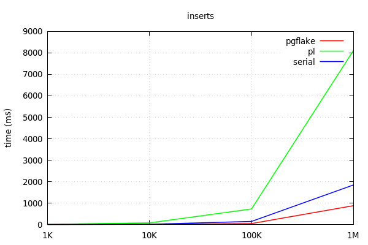

## PostgreSQL Notification Extension

A snowflake algorithm implemented as Postgres Extension. It uses time as first component and remain sortable. Ids are 64-bits, half the size of a UUID.

###  Solution

ID is composed of:

  - time - 41 bits (millisecond precision w/ a custom epoch gives us 69 years)
  - instance id - 10 bits - gives us up to 1024 postgres instances
  - sequence number - 12 bits - rolls over every 4096 per machine (with protection to avoid rollover in the same ms)

### System Clock Dependency

You should use NTP to keep your system clock accurate. It protects from non-monotonic clocks, i.e. clocks that run backwards.

## Building from source

- A standard PostgreSQL 12 or 11.4+ installation with development
environment (header files) (e.g., `postgresql-server-dev-11 `package
for Linux, Postgres.app for MacOS)
- C compiler (e.g., gcc or clang)
- [CMake](https://cmake.org/) version 3.4 or greater

```bash
git clone https://github.com/mausimag/pgflake.git
cd pgflake
make
sudo make install
```

## Configuring

You must configure the two following parameters before using:

    pgflake.instance_id: Sets the id of current intance. It must be unique between instances.

    pgflake.start_epoch: Sets the start epoch of current intance.

## Using pgflake

To activate extension, in a database you can simply do:

    CREATE EXTENSION IF NOT EXISTS pgflake;

Create one table:

    CREATE TABLE ttest (
        x bigint, 
        y bigint NOT NULL DEFAULT pgflake_generate()
    );

Now insert some data:

    INSERT INTO ttest (x) SELECT generate_series(1, 5);

Check generated IDs:

    SELECT * FROM ttest;
    x |          y          
    ---+---------------------
    1 | 1231425388031266816
    2 | 1231425388610080768
    3 | 1231425388626857984
    4 | 1231425388631052288
    5 | 1231425388635246592
    (5 rows)

You can use the following functions to extract information of id:

    SELECT 
    x
    y,
    pgflake_extract_time(y) as t, -- returns creation time of id
    pgflake_extract_instance(y) as i, -- returns instance number
    pgflake_extract_sequence(y) as s, -- returns the sequence number
    FROM ttest;

## Insert performance



## References

- https://instagram-engineering.com/sharding-ids-at-instagram-1cf5a71e5a5c
- https://medium.com/pinterest-engineering/sharding-pinterest-how-we-scaled-our-mysql-fleet-3f341e96ca6f